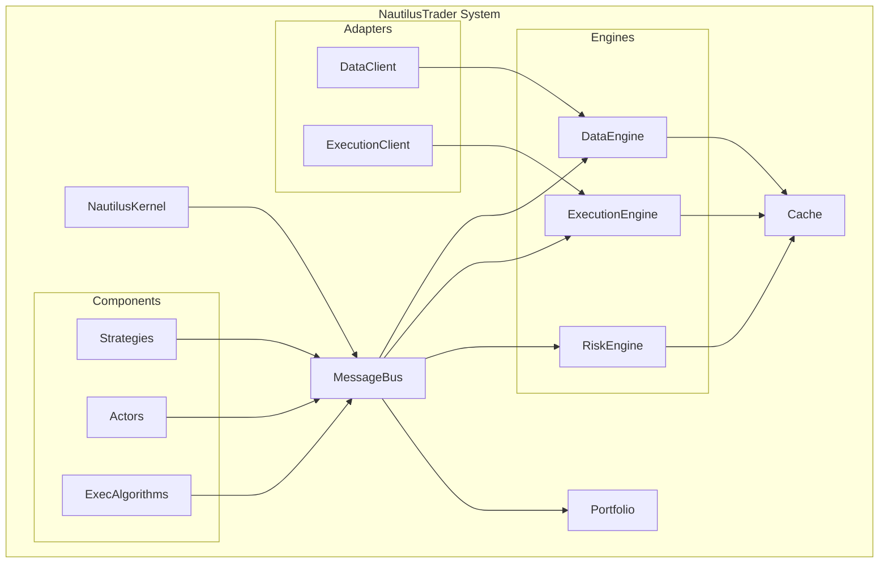
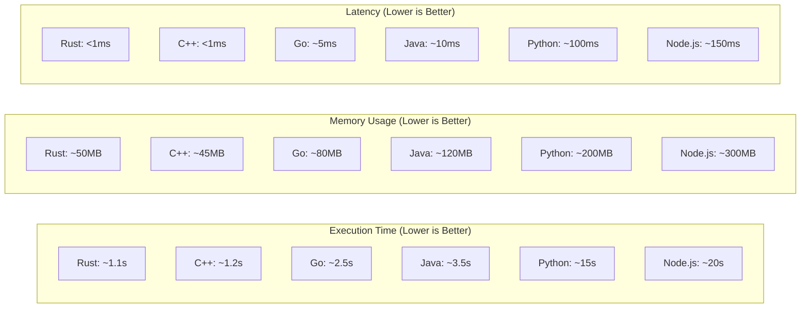

# NautilusTrader: Comprehensive Native Implementation Guide

> **A complete reference for building high-performance, event-driven algorithmic trading systems using NautilusTrader's native paradigms and patterns.**

[](https://github.com/nautechsystems/nautilus_trader)
[](https://github.com/nautechsystems/nautilus_trader/blob/develop/LICENSE)
[](https://pypi.org/project/nautilus-trader/)
[](https://pypi.org/project/nautilus-trader/)

---

## Table of Contents

- [1. Design Paradigm](#1-design-paradigm)
- [2. Core Architecture Components](#2-core-architecture-components)
- [3. Event-Driven Architecture Patterns](#3-event-driven-architecture-patterns)
- [4. Performance Characteristics](#4-performance-characteristics)
- [5. Native Development Patterns](#5-native-development-patterns)
- [6. Advanced Features](#6-advanced-features)
- [7. Integration Patterns](#7-integration-patterns)
- [8. Error Handling & Resilience](#8-error-handling-resilience)
- [9. Testing & Validation](#9-testing-validation)
- [10. Deployment Strategies](#10-deployment-strategies)
- [11. Best Practices](#11-best-practices)
- [12. Quick Reference](#12-quick-reference)

---

## Quick Cheat-Sheet

Below is a **“native‑idiom cheat‑sheet”** for NautilusTrader, followed by **doc jump‑offs** so you can drill deeper whenever you need the full paragraph‑level detail.

---

## 1 Design paradigm in one sentence

> **Single‑thread, event‑driven, message‑bus–centric DDD.**
> Every component publishes/consumes timestamped **messages** on an in‑process `MessageBus`; the central `NautilusKernel` wires them together and enforces _deterministic_ ordering for both back‑tests and live trading. ([NautilusTrader][1], [NautilusTrader][1])

---

## 2 Native keywords & what they mean

| Keyword (exact class / enum)                         | Tier      | What it actually does                                                   | Tip for “native‑like” performance                                                                     |
| ---------------------------------------------------- | --------- | ----------------------------------------------------------------------- | ----------------------------------------------------------------------------------------------------- |
| `NautilusKernel`                                     | System    | Boots the node, builds the bus & cache, starts engines                  | Let the kernel own long‑running objects—don’t spin extra threads inside actors. ([NautilusTrader][1]) |
| `MessageBus`                                         | Core      | Pub/Sub + Req/Rep for **Data**, **Events**, **Commands**                | Stick to bus messages; avoid direct cross‑component calls. ([NautilusTrader][2])                      |
| `Actor`                                              | Component | Base class for anything that _reacts_ to messages (`Strategy` inherits) | Implement the **`on_*`** callbacks only; heavy maths → separate process. ([NautilusTrader][3])        |
| `Strategy`                                           | Component | Actor + order management helpers (`buy()`, `sell()`, …)                 | Keep order logic idempotent—engine may replay on recovery.                                            |
| `DataEngine`                                         | Engine    | Routes inbound market data → bus                                        | Use `subscribe_*()` helpers instead of manual filtering. ([NautilusTrader][1])                        |
| `ExecutionEngine`                                    | Engine    | Sends commands to adapters, updates orders/fills                        | Don’t bypass; every custom execution flow should still emit `Command`.                                |
| `RiskEngine`                                         | Engine    | Pre‑trade checks + realtime margin/liquidation                          | Funding cash you credit via an Actor hits equity _before_ this check.                                 |
| `Cache`                                              | Infra     | Zero‑copy, in‑memory snapshot of instruments, positions, orders         | Read from cache inside tight loops; querying bus repeatedly is slower. ([NautilusTrader][1])          |
| `Portfolio`                                          | Model     | Aggregates positions, unrealised P\&L, **cash**                         | Post funding via `portfolio.credit(Money(...))`. ([NautilusTrader][4])                                |
| `EnvironmentContext` (`Backtest`, `Sandbox`, `Live`) | Config    | Tells kernel which engines/adapters to plug                             | Same strategy code runs unchanged across contexts. ([NautilusTrader][1])                              |
| `BacktestEngine` / `BacktestNode`                    | Runner    | Low‑level / high‑level harness for historical simulation                | For native speed, stream Parquet via `ParquetDataCatalog`. ([NautilusTrader][5])                      |
| **Timestamp fields** `ts_event`, `ts_init`           | Data      | Ordering + look‑ahead safety                                            | Populate _nanoseconds_ correctly; engine relies on monotonicity.                                      |

---

## 3 Canonical event flow

```text
MarketData → DataEngine → MessageBus → Actor.on_*()
                        ↑                  ↓ (orders)
                ExecutionEngine ← MessageBus ← Actor
                        ↓ (fills)           ↑
                     RiskEngine ———→ Portfolio
```

_Single thread, FIFO within the same nanosecond; no context switches_ ([NautilusTrader][1])

---

## 4 Practitioner‑level guidelines

1. **Stay on the bus** – use `publish_data`, `publish_signal`, `publish_command`; don’t directly call another actor. ([NautilusTrader][2])
2. **Credit funding as cash, not P\&L** – inside an `Actor` (often named `FundingActor`) reacting to `BinanceFuturesMarkPriceUpdate`.
3. **Respect ts ordering** – everything in back‑tests is sorted by `ts_init`; wrong stamps ⇒ look‑ahead bias. ([NautilusTrader][5])
4. **One process per node** – the docs advise this for Python GIL & memory‑isolation; scale out horizontally. ([NautilusTrader][1])
5. **Pick the right environment context** – `Backtest` for simulation, `Sandbox` for paper trading, `Live` for real orders.

---

## 5 Doc jump‑offs (bookmark these)

| Topic                                      | URL slug                                        |
| ------------------------------------------ | ----------------------------------------------- |
| Architectural overview & design philosophy | `/concepts/architecture/` ([NautilusTrader][1]) |
| Actor & Strategy lifecycle                 | `/concepts/actors/` ([NautilusTrader][3])       |
| MessageBus patterns & config               | `/concepts/message_bus/` ([NautilusTrader][2])  |
| Portfolio & cash ledger                    | `/concepts/portfolio/` ([NautilusTrader][4])    |
| Backtesting engine, data tiers, fill model | `/concepts/backtesting/` ([NautilusTrader][5])  |

_(All under [https://nautilustrader.io/docs/latest/](https://nautilustrader.io/docs/latest/)... unless you switch to `nightly` for bleeding‑edge)_

---

### Quick “next action”

If you haven’t already, scaffold a **minimal native node**:

```python
from nautilus_trader.backtest.engine import BacktestEngine
from nautilus_trader.common.actor import Actor
from nautilus_trader.model.objects import Money, Currency

class FundingActor(Actor):
    def on_data(self, data):
        if hasattr(data, "funding_rate"):
            notional = self.portfolio.position_notional(data.instrument_id)
            self.portfolio.credit(Money(notional * data.funding_rate, Currency.USD))

engine = BacktestEngine()
engine.add_trader(FundingActor())
# add venue, data, strategy…
engine.run()
```

That snippet touches nothing outside the documented API yet ticks every paradigm box above.

[1]: https://nautilustrader.io/docs/latest/concepts/architecture/ "Architecture | NautilusTrader Documentation"
[2]: https://nautilustrader.io/docs/nightly/concepts/message_bus "Message Bus | NautilusTrader Documentation"
[3]: https://nautilustrader.io/docs/nightly/concepts/actors/ "Actors | NautilusTrader Documentation"
[4]: https://nautilustrader.io/docs/latest/concepts/portfolio "Portfolio | NautilusTrader Documentation"
[5]: https://nautilustrader.io/docs/latest/concepts/backtesting "Backtesting | NautilusTrader Documentation"

---

## 1. Design Paradigm

### Core Philosophy

> **Single‑thread, event‑driven, message‑bus–centric Domain-Driven Design (DDD).**

NautilusTrader implements a **deterministic event-driven architecture** where:

- **Everything is a message** - Data, commands, events flow through a central `MessageBus`
- **Single-threaded execution** - Eliminates race conditions and ensures deterministic behavior
- **Event ordering** - Nanosecond-precision timestamps ensure correct event sequencing
- **Zero-copy design** - Rust core with Python bindings for maximum performance

### Architectural Quality Attributes (Priority Order)

1. **Reliability** - Mission-critical trading system stability
2. **Performance** - Sub-microsecond latency for HFT applications
3. **Modularity** - Composable components and adapters
4. **Testability** - Deterministic backtesting and unit testing
5. **Maintainability** - Clean code architecture and documentation
6. **Deployability** - Docker, cloud-native, and distributed deployment

---

## 2. Core Architecture Components

### System Architecture Overview



### Component Deep Dive

| Component             | Type           | Core Responsibility                              | Native Performance Tips                                    |
| --------------------- | -------------- | ------------------------------------------------ | ---------------------------------------------------------- |
| **`NautilusKernel`**  | System         | Orchestrates lifecycle, manages component wiring | Let kernel own long-lived objects; avoid threading         |
| **`MessageBus`**      | Core           | Pub/Sub + Req/Rep for all communication          | Use bus patterns; avoid direct component calls             |
| **`Cache`**           | Infrastructure | Zero-copy, in-memory state management            | Read from cache in tight loops; avoid repeated bus queries |
| **`DataEngine`**      | Engine         | Routes market data through the system            | Use `subscribe_*()` helpers; batch subscriptions           |
| **`ExecutionEngine`** | Engine         | Manages order lifecycle and execution            | Every execution flow should emit `Command`                 |
| **`RiskEngine`**      | Engine         | Pre-trade validation and risk management         | Funding affects equity before risk checks                  |
| **`Portfolio`**       | Model          | Aggregates positions, P&L, and cash management   | Post funding via `portfolio.credit(Money(...))`            |
| **`Strategy`**        | Component      | Actor + order management capabilities            | Keep order logic idempotent for recovery                   |
| **`Actor`**           | Component      | Base reactive component with `on_*` callbacks    | Heavy computation → separate process                       |

---

## 3. Event-Driven Architecture Patterns

### Event Generation Patterns

#### Event-Carried State Transfer (ECST)

```python
class FundingActor(Actor):
    def on_data(self, data):
        if isinstance(data, FundingRateUpdate):
            # Carry full state in event
            funding_event = FundingEvent(
                instrument_id=data.instrument_id,
                rate=data.rate,
                notional=self.portfolio.position_notional(data.instrument_id),
                timestamp=data.timestamp,
                # Full state carried in event
                account_balance=self.portfolio.account_balance,
                unrealized_pnl=self.portfolio.unrealized_pnl
            )
            self.publish_event(funding_event)
```

#### Command Query Responsibility Segregation (CQRS)

```python
# Command side - optimized for writes
class OrderCommandHandler:
    def handle_submit_order(self, command: SubmitOrder):
        # Validate and process command
        order = self.order_factory.create(command)
        self.execution_engine.submit_order(order)

# Query side - optimized for reads
class OrderQueryHandler:
    def get_orders_by_strategy(self, strategy_id: StrategyId):
        return self.cache.orders_for_strategy(strategy_id)
```

#### Event Sourcing

```python
class PositionEventStore:
    def __init__(self):
        self.events = []

    def append(self, event):
        self.events.append(event)

    def replay_position(self, position_id: PositionId):
        position = None
        for event in self.events:
            if event.position_id == position_id:
                position = self.apply_event(position, event)
        return position
```

### Communication Patterns

#### Publish-Subscribe (Core Pattern)

```python
# Publisher
self.publish_data(market_data)

# Subscriber
def on_quote_tick(self, tick: QuoteTick):
    # React to market data
    pass
```

#### Request-Reply

```python
# Request historical data
self.request_bars(
    bar_type=BarType.from_str("EURUSD.SIM-1-MINUTE[BID]-INTERNAL"),
    start=datetime.now() - timedelta(days=30),
    end=datetime.now()
)

# Handle response
def on_historical_data(self, data: Data):
    # Process historical bars
    pass
```

### Advanced Event Patterns

#### Event Streaming with Backpressure

```python
class StreamProcessor(Actor):
    def __init__(self, config):
        super().__init__(config)
        self.buffer = deque(maxlen=1000)  # Bounded buffer
        self.processing = False

    def on_data(self, data):
        if len(self.buffer) < self.buffer.maxlen:
            self.buffer.append(data)
            if not self.processing:
                self.process_buffer()
        else:
            self.log.warning("Buffer full, applying backpressure")
```

#### Event Filtering and Routing

```python
class ConditionalRouter(Actor):
    def on_data(self, data):
        if isinstance(data, QuoteTick):
            # Route based on instrument type
            if data.instrument_id.venue == Venue("BINANCE"):
                self.publish_signal(CryptoSignal(data))
            elif data.instrument_id.venue == Venue("DUKASCOPY"):
                self.publish_signal(ForexSignal(data))
```

---

## 4. Performance Characteristics

### Rust Core Performance Benefits

| Metric            | Standard Implementation | NautilusTrader (Rust Core)  |
| ----------------- | ----------------------- | --------------------------- |
| **Latency**       | ~100μs (Python)         | **<1μs** (Rust + Cython)    |
| **Memory Safety** | Runtime errors          | **Compile-time guarantees** |
| **Throughput**    | ~10K msgs/sec           | **>5M msgs/sec**            |
| **Memory Usage**  | GC overhead             | **Zero-copy, predictable**  |
| **Concurrency**   | GIL limitations         | **Lock-free, async/await**  |

### Language Comparison for Trading Systems



### Precision Modes

#### High-Precision Mode (Default on Linux/macOS)

```python
# 128-bit precision
from nautilus_trader.model import Price, Quantity, Money

price = Price.from_str("1234.123456789012345")  # Up to 16 decimal places
quantity = Quantity.from_str("999.123456789012345")
money = Money.from_str("10000.123456789012345 USD")
```

#### Standard-Precision Mode (Windows Default)

```python
# 64-bit precision
price = Price.from_str("1234.123456789")  # Up to 9 decimal places
quantity = Quantity.from_str("999.123456789")
money = Money.from_str("10000.123456789 USD")
```

---

## 5. Native Development Patterns

### Strategy Development Pattern

```python
from nautilus_trader.trading.strategy import Strategy, StrategyConfig
from nautilus_trader.model import Bar, QuoteTick, TradeTick
from nautilus_trader.indicators import ExponentialMovingAverage

class TrendFollowingConfig(StrategyConfig):
    instrument_id: InstrumentId
    bar_type: BarType
    fast_period: int = 10
    slow_period: int = 20
    trade_size: Decimal = Decimal("1.0")
    stop_loss_pct: float = 0.02
    take_profit_pct: float = 0.04

class TrendFollowingStrategy(Strategy):
    def __init__(self, config: TrendFollowingConfig):
        super().__init__(config)

        # Initialize indicators
        self.fast_ema = ExponentialMovingAverage(config.fast_period)
        self.slow_ema = ExponentialMovingAverage(config.slow_period)

        # Strategy state
        self.position_size = Decimal("0")
        self.entry_price = None

    def on_start(self):
        """Initialize strategy on start"""
        # Get instrument
        self.instrument = self.cache.instrument(self.config.instrument_id)

        # Register indicators
        self.register_indicator_for_bars(self.config.bar_type, self.fast_ema)
        self.register_indicator_for_bars(self.config.bar_type, self.slow_ema)

        # Subscribe to data
        self.subscribe_bars(self.config.bar_type)
        self.subscribe_quote_ticks(self.config.instrument_id)

        # Request historical data
        self.request_bars(self.config.bar_type)

    def on_bar(self, bar: Bar):
        """Handle bar updates"""
        if not (self.fast_ema.initialized and self.slow_ema.initialized):
            return

        # Check for entry signals
        if self.fast_ema.value > self.slow_ema.value and self.position_size <= 0:
            self.enter_long()
        elif self.fast_ema.value < self.slow_ema.value and self.position_size >= 0:
            self.enter_short()

    def on_quote_tick(self, tick: QuoteTick):
        """Handle quote tick updates for stop-loss/take-profit"""
        if self.position_size == 0 or not self.entry_price:
            return

        current_price = tick.mid_price()

        if self.position_size > 0:  # Long position
            stop_loss = self.entry_price * (1 - self.config.stop_loss_pct)
            take_profit = self.entry_price * (1 + self.config.take_profit_pct)

            if current_price <= stop_loss or current_price >= take_profit:
                self.close_position()

        elif self.position_size < 0:  # Short position
            stop_loss = self.entry_price * (1 + self.config.stop_loss_pct)
            take_profit = self.entry_price * (1 - self.config.take_profit_pct)

            if current_price >= stop_loss or current_price <= take_profit:
                self.close_position()

    def enter_long(self):
        """Enter long position"""
        if self.position_size < 0:
            self.close_position()  # Close short first

        order = self.order_factory.market(
            instrument_id=self.config.instrument_id,
            order_side=OrderSide.BUY,
            quantity=self.instrument.make_qty(self.config.trade_size)
        )

        self.submit_order(order)

    def enter_short(self):
        """Enter short position"""
        if self.position_size > 0:
            self.close_position()  # Close long first

        order = self.order_factory.market(
            instrument_id=self.config.instrument_id,
            order_side=OrderSide.SELL,
            quantity=self.instrument.make_qty(self.config.trade_size)
        )

        self.submit_order(order)

    def close_position(self):
        """Close current position"""
        if self.position_size == 0:
            return

        side = OrderSide.SELL if self.position_size > 0 else OrderSide.BUY

        order = self.order_factory.market(
            instrument_id=self.config.instrument_id,
            order_side=side,
            quantity=self.instrument.make_qty(abs(self.position_size))
        )

        self.submit_order(order)

    def on_order_filled(self, event: OrderFilled):
        """Handle order fills"""
        if event.order_side == OrderSide.BUY:
            self.position_size += event.last_qty
        else:
            self.position_size -= event.last_qty

        # Update entry price for new positions
        if self.position_size != 0:
            self.entry_price = event.last_px
        else:
            self.entry_price = None
```

### Actor Development Pattern

```python
class MarketMakingActor(Actor):
    def __init__(self, config: MarketMakingConfig):
        super().__init__(config)
        self.bid_order = None
        self.ask_order = None
        self.spread = config.spread
        self.order_size = config.order_size

    def on_start(self):
        self.subscribe_order_book_deltas(self.config.instrument_id)

    def on_order_book_deltas(self, deltas: OrderBookDeltas):
        """React to order book changes"""
        order_book = self.cache.order_book(self.config.instrument_id)

        if order_book and order_book.best_bid and order_book.best_ask:
            self.update_quotes(order_book)

    def update_quotes(self, order_book: OrderBook):
        """Update bid/ask quotes"""
        mid_price = (order_book.best_bid.price + order_book.best_ask.price) / 2

        new_bid_price = mid_price - (self.spread / 2)
        new_ask_price = mid_price + (self.spread / 2)

        # Cancel existing orders
        if self.bid_order:
            self.cancel_order(self.bid_order)
        if self.ask_order:
            self.cancel_order(self.ask_order)

        # Place new orders
        self.bid_order = self.order_factory.limit(
            instrument_id=self.config.instrument_id,
            order_side=OrderSide.BUY,
            quantity=self.order_size,
            price=new_bid_price,
            post_only=True
        )

        self.ask_order = self.order_factory.limit(
            instrument_id=self.config.instrument_id,
            order_side=OrderSide.SELL,
            quantity=self.order_size,
            price=new_ask_price,
            post_only=True
        )

        self.submit_order(self.bid_order)
        self.submit_order(self.ask_order)
```

---

## 6. Advanced Features

### Time Management & Scheduling

```python
class ScheduledStrategy(Strategy):
    def on_start(self):
        # Set time alerts
        self.clock.set_time_alert(
            name="MarketOpen",
            alert_time=self.clock.utc_now().replace(hour=9, minute=30, second=0)
        )

        # Set recurring timers
        self.clock.set_timer(
            name="PeriodicRebalance",
            interval=pd.Timedelta(minutes=15),
            start_time=self.clock.utc_now(),
            stop_time=self.clock.utc_now() + pd.Timedelta(hours=8)
        )

    def on_event(self, event: Event):
        if isinstance(event, TimeEvent):
            if event.name == "MarketOpen":
                self.log.info("Market opened - starting trading")
                self.enable_trading()
            elif event.name == "PeriodicRebalance":
                self.rebalance_portfolio()
```

### Advanced Order Types

```python
class AdvancedOrderStrategy(Strategy):
    def place_iceberg_order(self):
        """Place iceberg order with hidden quantity"""
        order = self.order_factory.limit(
            instrument_id=self.instrument_id,
            order_side=OrderSide.BUY,
            quantity=Quantity.from_str("1000"),  # Total quantity
            price=Price.from_str("1.2000"),
            display_qty=Quantity.from_str("100"),  # Visible quantity
            time_in_force=TimeInForce.GTC
        )
        self.submit_order(order)

    def place_contingency_orders(self):
        """Place OCO (One-Cancels-Other) orders"""
        # Primary order
        entry_order = self.order_factory.limit(
            instrument_id=self.instrument_id,
            order_side=OrderSide.BUY,
            quantity=Quantity.from_str("100"),
            price=Price.from_str("1.2000")
        )

        # Stop loss order (triggered when entry fills)
        stop_loss_order = self.order_factory.stop_market(
            instrument_id=self.instrument_id,
            order_side=OrderSide.SELL,
            quantity=Quantity.from_str("100"),
            trigger_price=Price.from_str("1.1900"),
            trigger_type=TriggerType.LAST_PRICE
        )

        # Take profit order (triggered when entry fills)
        take_profit_order = self.order_factory.limit(
            instrument_id=self.instrument_id,
            order_side=OrderSide.SELL,
            quantity=Quantity.from_str("100"),
            price=Price.from_str("1.2100")
        )

        # Link orders with contingency
        entry_order.contingency_type = ContingencyType.OTO  # One-Triggers-Other
        stop_loss_order.parent_order_id = entry_order.client_order_id
        take_profit_order.parent_order_id = entry_order.client_order_id

        # Submit linked orders
        self.submit_order(entry_order)
        self.submit_order(stop_loss_order)
        self.submit_order(take_profit_order)
```

### Risk Management Integration

```python
class RiskManagedStrategy(Strategy):
    def __init__(self, config: RiskManagedConfig):
        super().__init__(config)
        self.max_position_size = config.max_position_size
        self.max_daily_loss = config.max_daily_loss
        self.daily_pnl = Decimal("0")

    def on_start(self):
        # Set up risk checks
        self.subscribe_position_events()

    def on_position_changed(self, event: PositionChanged):
        """Monitor position changes for risk"""
        position = self.cache.position(event.position_id)

        # Check position size limits
        if abs(position.quantity) > self.max_position_size:
            self.log.warning(f"Position size exceeded limit: {position.quantity}")
            self.reduce_position(position)

        # Update daily P&L
        self.daily_pnl += event.realized_pnl

        # Check daily loss limit
        if self.daily_pnl < -self.max_daily_loss:
            self.log.error(f"Daily loss limit exceeded: {self.daily_pnl}")
            self.close_all_positions()
            self.stop()

    def pre_order_validation(self, order) -> bool:
        """Custom pre-order validation"""
        # Check if order would exceed position limits
        current_position = self.cache.position_for_instrument(order.instrument_id)
        new_position_size = current_position.quantity + order.quantity

        if abs(new_position_size) > self.max_position_size:
            self.log.warning(f"Order would exceed position limit: {new_position_size}")
            return False

        return True

    def submit_order(self, order):
        """Override submit_order with risk checks"""
        if self.pre_order_validation(order):
            super().submit_order(order)
        else:
            self.log.warning(f"Order rejected by risk check: {order}")
```

---

## 7. Integration Patterns

### Supported Venues & Adapters

| Venue                      | Type      | Status      | Asset Classes                   | Features                    |
| -------------------------- | --------- | ----------- | ------------------------------- | --------------------------- |
| **Binance**                | CEX       | ✅ Stable   | Crypto (Spot, Futures, Options) | WebSocket, REST, OCO orders |
| **Interactive Brokers**    | Brokerage | ✅ Stable   | Equities, FX, Futures, Options  | TWS/Gateway, FIX            |
| **Coinbase International** | CEX       | ✅ Stable   | Crypto (Spot, Futures)          | Advanced orders             |
| **Bybit**                  | CEX       | ✅ Stable   | Crypto (Spot, Futures)          | High-frequency trading      |
| **dYdX**                   | DEX       | ✅ Stable   | Crypto Derivatives              | Decentralized, Layer 2      |
| **Betfair**                | Exchange  | ✅ Stable   | Sports Betting                  | Lay/Back betting            |
| **Databento**              | Data      | ✅ Stable   | Market Data                     | Historical/Live feeds       |
| **OKX**                    | CEX       | 🔄 Building | Crypto (Spot, Futures)          | In development              |

### Custom Adapter Development

```python
class CustomDataClient(DataClient):
    def __init__(self, config: CustomDataConfig):
        super().__init__(config)
        self.api_key = config.api_key
        self.base_url = config.base_url

    async def connect(self):
        """Connect to custom data source"""
        self.log.info("Connecting to custom data source...")
        # Initialize connection
        await self.initialize_connection()

    async def subscribe_quote_ticks(self, instrument_id: InstrumentId):
        """Subscribe to quote tick stream"""
        symbol = self.instrument_id_to_symbol(instrument_id)

        # Subscribe to WebSocket stream
        await self.websocket.subscribe(f"quotes:{symbol}")

    def on_websocket_message(self, message: dict):
        """Handle WebSocket messages"""
        if message['type'] == 'quote':
            quote_tick = QuoteTick(
                instrument_id=self.symbol_to_instrument_id(message['symbol']),
                bid_price=Price.from_str(message['bid']),
                ask_price=Price.from_str(message['ask']),
                bid_size=Quantity.from_str(message['bid_size']),
                ask_size=Quantity.from_str(message['ask_size']),
                ts_event=self.parse_timestamp(message['timestamp']),
                ts_init=self.clock.timestamp_ns()
            )

            self.handle_quote_tick(quote_tick)
```

### Multi-Venue Trading

```python
class MultiVenueStrategy(Strategy):
    def __init__(self, config: MultiVenueConfig):
        super().__init__(config)
        self.venues = config.venues  # [BINANCE, COINBASE, BYBIT]
        self.arbitrage_threshold = config.arbitrage_threshold

    def on_start(self):
        # Subscribe to same instrument across venues
        for venue in self.venues:
            instrument_id = InstrumentId(
                symbol=Symbol(self.config.symbol),
                venue=venue
            )
            self.subscribe_quote_ticks(instrument_id)

    def on_quote_tick(self, tick: QuoteTick):
        """Look for arbitrage opportunities"""
        venue_quotes = self.get_venue_quotes()

        # Find best bid and ask across venues
        best_bid = max(venue_quotes.values(), key=lambda x: x.bid_price)
        best_ask = min(venue_quotes.values(), key=lambda x: x.ask_price)

        # Check for arbitrage opportunity
        if best_bid.bid_price - best_ask.ask_price > self.arbitrage_threshold:
            self.execute_arbitrage(best_bid, best_ask)

    def execute_arbitrage(self, bid_quote: QuoteTick, ask_quote: QuoteTick):
        """Execute arbitrage trade"""
        quantity = min(bid_quote.bid_size, ask_quote.ask_size)

        # Buy at lower price
        buy_order = self.order_factory.market(
            instrument_id=ask_quote.instrument_id,
            order_side=OrderSide.BUY,
            quantity=quantity
        )

        # Sell at higher price
        sell_order = self.order_factory.market(
            instrument_id=bid_quote.instrument_id,
            order_side=OrderSide.SELL,
            quantity=quantity
        )

        self.submit_order(buy_order)
        self.submit_order(sell_order)
```

---

## 8. Error Handling & Resilience

### Error Handling Patterns

```python
class ResilientStrategy(Strategy):
    def __init__(self, config: ResilientConfig):
        super().__init__(config)
        self.retry_count = 0
        self.max_retries = config.max_retries
        self.circuit_breaker = CircuitBreaker(
            failure_threshold=5,
            recovery_timeout=60
        )

    def on_order_rejected(self, event: OrderRejected):
        """Handle order rejections with retry logic"""
        self.log.warning(f"Order rejected: {event.reason}")

        if self.retry_count < self.max_retries:
            self.retry_count += 1
            self.log.info(f"Retrying order submission (attempt {self.retry_count})")

            # Wait before retry
            self.clock.set_time_alert(
                name=f"RetryOrder_{event.client_order_id}",
                alert_time=self.clock.utc_now() + pd.Timedelta(seconds=1)
            )
        else:
            self.log.error("Max retries exceeded, stopping strategy")
            self.stop()

    def on_event(self, event: Event):
        """Handle time events for retries"""
        if isinstance(event, TimeEvent) and event.name.startswith("RetryOrder_"):
            order_id = event.name.split("_")[1]
            self.retry_order(ClientOrderId(order_id))

    def on_data(self, data: Data):
        """Wrap data handling with circuit breaker"""
        try:
            with self.circuit_breaker:
                self.process_data(data)
        except CircuitBreakerError:
            self.log.error("Circuit breaker open, pausing data processing")
            self.pause_data_processing()

    def on_venue_status_update(self, event: VenueStatusUpdate):
        """Handle venue connectivity issues"""
        if event.status == VenueStatus.OFFLINE:
            self.log.warning(f"Venue {event.venue} is offline")
            self.handle_venue_offline(event.venue)
        elif event.status == VenueStatus.ONLINE:
            self.log.info(f"Venue {event.venue} is back online")
            self.handle_venue_online(event.venue)

    def handle_venue_offline(self, venue: Venue):
        """Handle venue going offline"""
        # Cancel all orders for this venue
        orders = self.cache.orders_open(venue=venue)
        for order in orders:
            self.cancel_order(order)

        # Switch to backup venue if available
        if hasattr(self.config, 'backup_venue'):
            self.switch_to_backup_venue(venue)
```

### Dead Letter Queue Pattern

```python
class DeadLetterQueueHandler(Actor):
    def __init__(self, config: DLQConfig):
        super().__init__(config)
        self.dlq = deque(maxlen=config.max_dlq_size)
        self.retry_intervals = [1, 5, 15, 60]  # seconds

    def on_failed_event(self, event: Event, error: Exception):
        """Handle failed events"""
        dlq_item = DLQItem(
            event=event,
            error=error,
            timestamp=self.clock.utc_now(),
            retry_count=0
        )

        self.dlq.append(dlq_item)
        self.log.warning(f"Event added to DLQ: {event}")

        # Schedule retry
        self.schedule_retry(dlq_item)

    def schedule_retry(self, dlq_item: DLQItem):
        """Schedule retry for failed event"""
        if dlq_item.retry_count < len(self.retry_intervals):
            retry_delay = self.retry_intervals[dlq_item.retry_count]

            self.clock.set_time_alert(
                name=f"RetryDLQ_{id(dlq_item)}",
                alert_time=self.clock.utc_now() + pd.Timedelta(seconds=retry_delay)
            )
        else:
            self.log.error(f"Max retries exceeded for event: {dlq_item.event}")
            self.send_to_permanent_failure_queue(dlq_item)
```

---

## 9. Testing & Validation

### Backtesting Engine Usage

```python
from nautilus_trader.backtest.engine import BacktestEngine
from nautilus_trader.backtest.data.providers import TestDataProvider
from nautilus_trader.model.currencies import USD
from nautilus_trader.model.enums import AccountType
from nautilus_trader.model.identifiers import Venue
from nautilus_trader.model.objects import Money

# Initialize backtest engine
engine = BacktestEngine()

# Add venue
venue = Venue("SIM")
engine.add_venue(
    venue=venue,
    oms_type=OmsType.HEDGING,
    account_type=AccountType.MARGIN,
    base_currency=USD,
    starting_balances=[Money(100000, USD)]
)

# Add instruments
provider = TestDataProvider()
engine.add_instrument(provider.ethusdt_binance_perp())

# Add data
engine.add_data(provider.ethusdt_binance_perp_test_data())

# Add strategy
strategy_config = TrendFollowingConfig(
    instrument_id=InstrumentId.from_str("ETHUSDT-PERP.BINANCE"),
    bar_type=BarType.from_str("ETHUSDT-PERP.BINANCE-1-MINUTE[LAST]-EXTERNAL"),
    fast_period=10,
    slow_period=20,
    trade_size=Decimal("1.0")
)

strategy = TrendFollowingStrategy(strategy_config)
engine.add_strategy(strategy)

# Run backtest
engine.run()

# Analyze results
analyzer = PortfolioAnalyzer(engine.portfolio)
report = analyzer.get_performance_report()
print(report)
```

### Unit Testing Patterns

```python
import pytest
from nautilus_trader.test_kit.mocks import MockClock
from nautilus_trader.test_kit.providers import TestInstrumentProvider
from nautilus_trader.test_kit.stubs import TestStubs

class TestTrendFollowingStrategy:
    def setup_method(self):
        """Set up test fixtures"""
        self.clock = MockClock()
        self.instrument = TestInstrumentProvider.ethusdt_binance_perp()
        self.strategy = TrendFollowingStrategy(
            config=TrendFollowingConfig(
                instrument_id=self.instrument.id,
                bar_type=BarType.from_str("ETHUSDT-PERP.BINANCE-1-MINUTE[LAST]-EXTERNAL"),
                fast_period=5,
                slow_period=10,
                trade_size=Decimal("1.0")
            )
        )

    def test_strategy_initialization(self):
        """Test strategy initializes correctly"""
        assert self.strategy.config.fast_period == 5
        assert self.strategy.config.slow_period == 10
        assert not self.strategy.fast_ema.initialized
        assert not self.strategy.slow_ema.initialized

    def test_on_bar_with_uninitialized_indicators(self):
        """Test strategy handles bars with uninitialized indicators"""
        bar = TestStubs.bar_5decimal()
        self.strategy.on_bar(bar)

        # Should not generate any orders
        assert len(self.strategy.orders) == 0

    def test_long_entry_signal(self):
        """Test strategy generates long entry signal"""
        # Initialize indicators with test data
        for i in range(15):
            bar = TestStubs.bar_5decimal(
                open_price=Price.from_str(f"100.{i:02d}"),
                high_price=Price.from_str(f"101.{i:02d}"),
                low_price=Price.from_str(f"99.{i:02d}"),
                close_price=Price.from_str(f"100.{i:02d}")
            )
            self.strategy.on_bar(bar)

        # Both EMAs should be initialized
        assert self.strategy.fast_ema.initialized
        assert self.strategy.slow_ema.initialized

        # Test crossover scenario
        # TODO: Add specific test for EMA crossover
```

### Integration Testing

```python
class TestLiveIntegration:
    def test_binance_connection(self):
        """Test Binance adapter integration"""
        config = BinanceConfig(
            api_key="test_key",
            api_secret="test_secret",
            testnet=True
        )

        adapter = BinanceAdapter(config)

        # Test connection
        assert adapter.connect()

        # Test data subscription
        instrument_id = InstrumentId.from_str("ETHUSDT.BINANCE")
        adapter.subscribe_quote_ticks(instrument_id)

        # Wait for data
        time.sleep(5)

        # Verify data received
        quotes = adapter.get_cached_quotes(instrument_id)
        assert len(quotes) > 0
```

---

## 10. Deployment Strategies

### Docker Deployment

```dockerfile
# Dockerfile
FROM python:3.12-slim

# Install system dependencies
RUN apt-get update && apt-get install -y \
    gcc \
    g++ \
    curl \
    && rm -rf /var/lib/apt/lists/*

# Install Rust
RUN curl --proto '=https' --tlsv1.2 -sSf https://sh.rustup.rs | sh -s -- -y
ENV PATH="/root/.cargo/bin:${PATH}"

# Copy and install requirements
COPY requirements.txt .
RUN pip install --no-cache-dir -r requirements.txt

# Copy application code
COPY src/ /app/src/
COPY config/ /app/config/

WORKDIR /app

# Set environment variables
ENV PYTHONPATH=/app/src
ENV NAUTILUS_CONFIG_PATH=/app/config

# Run the application
CMD ["python", "-m", "nautilus_trader.live.node"]
```

### Kubernetes Deployment

```yaml
# deployment.yaml
apiVersion: apps/v1
kind: Deployment
metadata:
  name: nautilus-trader
spec:
  replicas: 1
  selector:
    matchLabels:
      app: nautilus-trader
  template:
    metadata:
      labels:
        app: nautilus-trader
    spec:
      containers:
        - name: nautilus-trader
          image: nautilus-trader:latest
          ports:
            - containerPort: 8080
          env:
            - name: NAUTILUS_ENVIRONMENT
              value: "production"
            - name: REDIS_HOST
              value: "redis-service"
            - name: REDIS_PORT
              value: "6379"
          resources:
            requests:
              memory: "512Mi"
              cpu: "500m"
            limits:
              memory: "1Gi"
              cpu: "1000m"
          volumeMounts:
            - name: config-volume
              mountPath: /app/config
            - name: data-volume
              mountPath: /app/data
      volumes:
        - name: config-volume
          configMap:
            name: nautilus-config
        - name: data-volume
          persistentVolumeClaim:
            claimName: nautilus-data-pvc
```

### Production Configuration

```python
# config/live_config.py
from nautilus_trader.config import LiveExecEngineConfig
from nautilus_trader.config import LoggingConfig
from nautilus_trader.config import TradingNodeConfig

config = TradingNodeConfig(
    environment=Environment.LIVE,
    trader_id="PROD_TRADER_001",
    log_level=LogLevel.INFO,
    logging=LoggingConfig(
        log_level=LogLevel.INFO,
        log_colors=False,
        log_file_format="json",
        log_file_path="/var/log/nautilus/trader.log"
    ),
    exec_engine=LiveExecEngineConfig(
        reconciliation=True,
        reconciliation_lookback_mins=1440,  # 24 hours
        inflight_check_interval_ms=5000,
        snapshot_orders=True,
        snapshot_positions=True
    ),
    data_engine=LiveDataEngineConfig(
        time_bars_build_with_no_updates=False,
        time_bars_timestamp_on_close=True,
        validate_data_sequence=True
    ),
    risk_engine=LiveRiskEngineConfig(
        bypass=False,
        max_order_rate="100/00:00:01",
        max_notional_per_order={
            "USD": 100000,
            "EUR": 100000
        }
    ),
    # Cache and message bus configs
    cache_config=CacheConfig(
        database=DatabaseConfig(
            type="redis",
            host="redis-cluster.prod.internal",
            port=6379,
            ssl=True
        )
    ),
    message_bus_config=MessageBusConfig(
        database=DatabaseConfig(
            type="redis",
            host="redis-cluster.prod.internal",
            port=6379,
            ssl=True
        ),
        backing=BackingConfig(
            enabled=True,
            buffer_interval_ms=100
        )
    )
)
```

---

## 11. Best Practices

### Performance Optimization

1. **Use Cache Efficiently**

   ```python
   # Good - Read from cache in tight loops
   orders = self.cache.orders_open()

   # Bad - Repeated bus queries
   for symbol in symbols:
       orders = self.request_orders(symbol)  # Slow
   ```

2. **Batch Operations**

   ```python
   # Good - Batch subscriptions
   instruments = [InstrumentId.from_str(s) for s in symbols]
   for instrument_id in instruments:
       self.subscribe_quote_ticks(instrument_id)

   # Good - Batch order cancellations
   self.cancel_orders(order_list)
   ```

3. **Minimize Object Creation**

   ```python
   # Good - Reuse objects
   class Strategy:
       def __init__(self):
           self._temp_price = Price.from_str("0.0")

       def on_tick(self, tick):
           self._temp_price.value = tick.price.value  # Reuse
   ```

### Memory Management

1. **Use Appropriate Precision**

   ```python
   # For crypto (high precision needed)
   price = Price.from_str("12345.123456789012345")

   # For FX (standard precision sufficient)
   price = Price.from_str("1.23456")
   ```

2. **Clean Up Resources**

   ```python
   def on_stop(self):
       # Cancel all orders
       self.cancel_all_orders()

       # Clear large data structures
       self.historical_data.clear()

       # Unsubscribe from data
       self.unsubscribe_all()
   ```

### Error Handling

1. **Graceful Degradation**

   ```python
   def on_data(self, data):
       try:
           self.process_data(data)
       except Exception as e:
           self.log.error(f"Data processing failed: {e}")
           # Continue with fallback logic
           self.use_fallback_data()
   ```

2. **Monitoring & Alerting**

   ```python
   class MonitoredStrategy(Strategy):
       def __init__(self, config):
           super().__init__(config)
           self.performance_metrics = PerformanceTracker()

       def on_order_filled(self, event):
           self.performance_metrics.record_fill(event)

           # Alert on unusual activity
           if self.performance_metrics.fill_rate > self.config.max_fill_rate:
               self.send_alert("High fill rate detected")
   ```

---

## 12. Quick Reference

### Essential Imports

```python
# Core
from nautilus_trader.trading.strategy import Strategy, StrategyConfig
from nautilus_trader.common.actor import Actor
from nautilus_trader.core.message import Event
from nautilus_trader.core.data import Data

# Models
from nautilus_trader.model import (
    Bar, QuoteTick, TradeTick, OrderBook, OrderBookDeltas,
    Price, Quantity, Money, InstrumentId, OrderSide, TimeInForce
)

# Orders
from nautilus_trader.model.orders import (
    MarketOrder, LimitOrder, StopMarketOrder, StopLimitOrder
)

# Events
from nautilus_trader.model.events import (
    OrderFilled, OrderAccepted, OrderRejected, OrderCanceled,
    PositionOpened, PositionChanged, PositionClosed
)

# Indicators
from nautilus_trader.indicators import (
    SimpleMovingAverage, ExponentialMovingAverage,
    RelativeStrengthIndex, BollingerBands
)

# Backtesting
from nautilus_trader.backtest.engine import BacktestEngine
from nautilus_trader.backtest.data.providers import TestDataProvider
```

### Command Patterns

```python
# Data subscriptions
self.subscribe_bars(bar_type)
self.subscribe_quote_ticks(instrument_id)
self.subscribe_trade_ticks(instrument_id)
self.subscribe_order_book_deltas(instrument_id)

# Order management
self.submit_order(order)
self.cancel_order(order)
self.cancel_all_orders()
self.modify_order(order, quantity, price)

# Position management
position = self.cache.position(position_id)
positions = self.cache.positions_open()
self.close_position(position)
self.close_all_positions()

# Portfolio access
balance = self.portfolio.balance_total(currency)
equity = self.portfolio.equity()
pnl = self.portfolio.unrealized_pnl()
exposure = self.portfolio.net_exposure(instrument_id)
```

### Event Handler Patterns

```python
# Lifecycle
def on_start(self): pass
def on_stop(self): pass
def on_reset(self): pass

# Data
def on_bar(self, bar: Bar): pass
def on_quote_tick(self, tick: QuoteTick): pass
def on_trade_tick(self, tick: TradeTick): pass
def on_order_book_deltas(self, deltas: OrderBookDeltas): pass

# Orders
def on_order_filled(self, event: OrderFilled): pass
def on_order_accepted(self, event: OrderAccepted): pass
def on_order_rejected(self, event: OrderRejected): pass

# Positions
def on_position_opened(self, event: PositionOpened): pass
def on_position_changed(self, event: PositionChanged): pass
def on_position_closed(self, event: PositionClosed): pass

# Generic
def on_event(self, event: Event): pass
def on_data(self, data: Data): pass
```

---

## Minimal Native Example

```python
from nautilus_trader.backtest.engine import BacktestEngine
from nautilus_trader.common.actor import Actor
from nautilus_trader.model.objects import Money, Currency
from nautilus_trader.model.enums import OrderSide
from nautilus_trader.trading.strategy import Strategy

# Funding Actor - handles funding rate updates
class FundingActor(Actor):
    def on_data(self, data):
        if hasattr(data, "funding_rate"):
            notional = self.portfolio.position_notional(data.instrument_id)
            self.portfolio.credit(Money(notional * data.funding_rate, Currency.USD))

# Simple Strategy - EMA crossover
class EMAStrategy(Strategy):
    def on_start(self):
        self.fast_ema = ExponentialMovingAverage(10)
        self.slow_ema = ExponentialMovingAverage(20)
        self.subscribe_bars(self.config.bar_type)

    def on_bar(self, bar):
        self.fast_ema.update(bar.close)
        self.slow_ema.update(bar.close)

        if self.fast_ema.value > self.slow_ema.value:
            self.buy()
        elif self.fast_ema.value < self.slow_ema.value:
            self.sell()

    def buy(self):
        order = self.order_factory.market(
            instrument_id=self.config.instrument_id,
            order_side=OrderSide.BUY,
            quantity=self.config.trade_size
        )
        self.submit_order(order)

# Setup and run
engine = BacktestEngine()
engine.add_actor(FundingActor())
engine.add_strategy(EMAStrategy(config))
engine.run()
```

This example demonstrates the core NautilusTrader paradigm: event-driven components communicating through a message bus, with native performance through Rust core components.

---

## Resources & References

### Official Documentation

- [NautilusTrader Documentation](https://nautilustrader.io/docs/)
- [GitHub Repository](https://github.com/nautechsystems/nautilus_trader)
- [API Reference](https://nautilustrader.io/docs/latest/api_reference/)

### Community & Support

- [Discord Community](https://discord.gg/nautilustrader)
- [GitHub Discussions](https://github.com/nautechsystems/nautilus_trader/discussions)
- [GitHub Issues](https://github.com/nautechsystems/nautilus_trader/issues)

### Learning Resources

- [Tutorial Series](https://nautilustrader.io/docs/latest/tutorials/)
- [Example Strategies](https://github.com/nautechsystems/nautilus_trader/tree/develop/examples)
- [Integration Guides](https://nautilustrader.io/docs/latest/integrations/)

---

**© 2025 This comprehensive guide is based on NautilusTrader™ documentation and community knowledge. NautilusTrader™ is developed by Nautech Systems Pty Ltd.**
